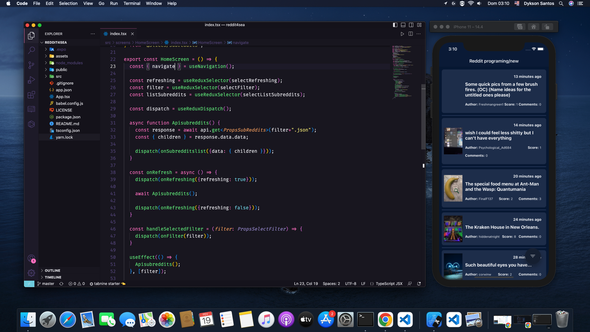
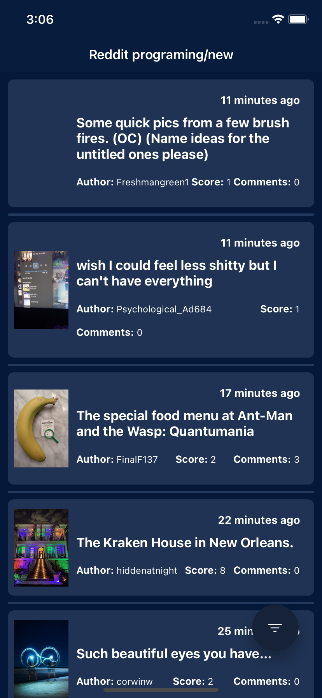
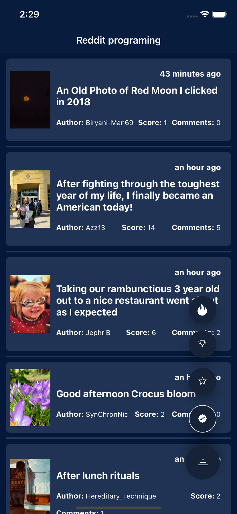
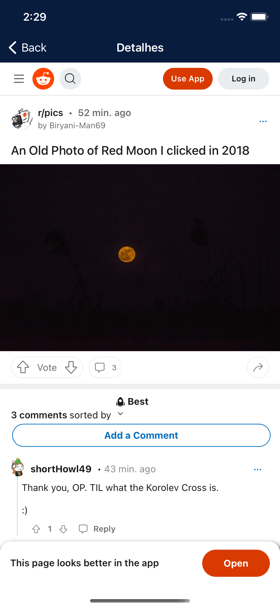

<h1>Reddit4sea</h1>

> Status: concluído 🚀
### Desafio para desenvolvedor mobile

### Descrição

> Neste desafio, você criará um aplicativo básico do Reddit com React Native.
> Reddit é um site de notícias onde os usuários registrados podem enviar postagens ou links para conteúdo que outros usuários podem votar e comentar. Cada uma dessas postagens é agrupada em categorias conhecidas como "subreddits".
> Seu aplicativo da web deve listar as últimas postagens do subreddit r/pics.

### Reddit4sea

Requisitos
Listagem de ingressos:

- Mostrar uma lista das postagens no subreddit r/pics ✅
- Cada postagem deve conter os seguintes dados:
- Imagem em miniatura (se houver), ✅
- Título, ✅
- Autor, ✅
- Número total de votos (pontuação), ✅
- Número de comentários e data de criação ✅
- Armazenar os dados na store global com Mobx; - Trocado pelo asyncStorage e redux-persist ✅

### Tecnologias

- React Native
- Typescript
- Expo

### Adicionais

- Api de ser consumida para o desafio segue abaixo

> Documentation: https://github-com.translate.goog/reddit/reddit/wiki/JSON?_x_tr_sl=auto&_x_tr_tl=pt&_x_tr_hl=pt-BR&_x_tr_pto=wapp
---

# 🎨 Layout

O layout da aplicação foi desenvolvido por mim mesmo

### Visão App Reddit4sea

### Home - Reddit4sea

A tela principal home lista todos os subreddits

### Home - Filtro tópicos “principais”, “novos”, “quentes” ou “controversos"

Na tela Home mesmo contém uma botão de filtro para buscar por tópico o pics desejado.

### About - Reddit4sea / Usuário pode ver detalhes do pics clicado

Nesta tela contém todos detalhes em uma página web sobre o pics.

Como executar o projeto 🚀

#### Clone este repositório :

> git clone https://github.com/Dyksonn/reddit4sea.git
#### Acesse a pasta do projeto no seu terminal/cmd:

> cd reddit4sea
#### check se esta na banch main

#### Instalando dependências :

> yarn
### ou

> npm install
### Execute a aplicação em modo de desenvolvimento

> npx expo start
# 🛠 Dependências

> Principais biblioteca usadas no projeto: 🔥
- @expo/vector-icons - Biblioteca de icones.

- react-native-webview - Exibir página web dentro aplicativo

- lottie-react-native - Animações.

- Eslint - Ferramenta para identificar e relatar os padrões encontrados no código ECMAScript / JavaScript, com o objetivo de tornar o código mais consistente e evitar bugs.

- Axios - Cliente HTTP baseado em promessa para node.
  jse o navegador.

Veja o arquivo <a>package.json</a>

> Utilitários
- Editor: Visual Studio Code

### 🦸 Desenvolvedor 🤘

Feito com ❤️ por Dykson Victor 👋🏽 Entre em contato!

> Email: dykson.santos@gmail.com
> Linkedin: Dykson Santos